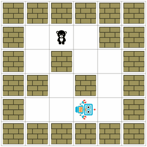
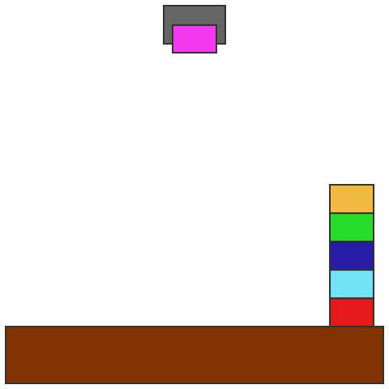
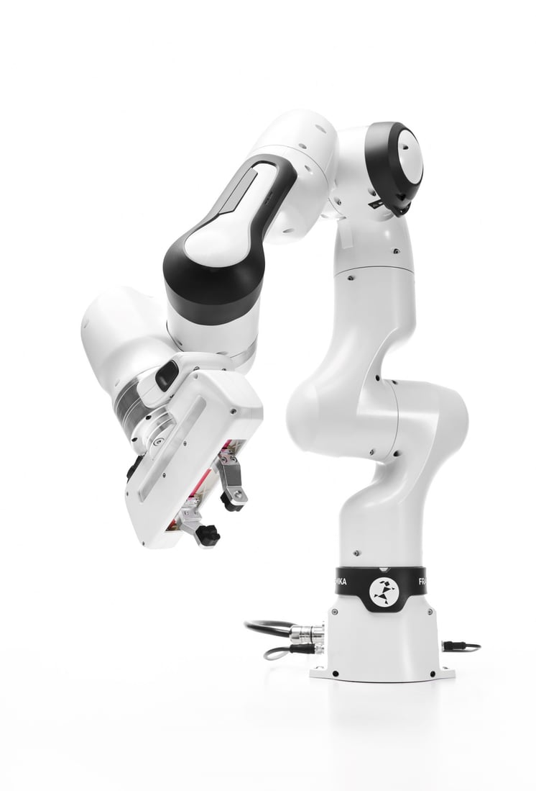
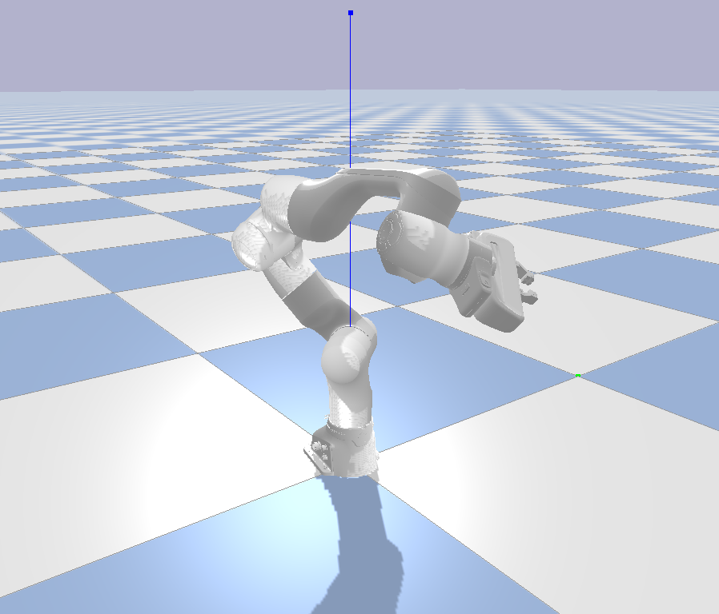
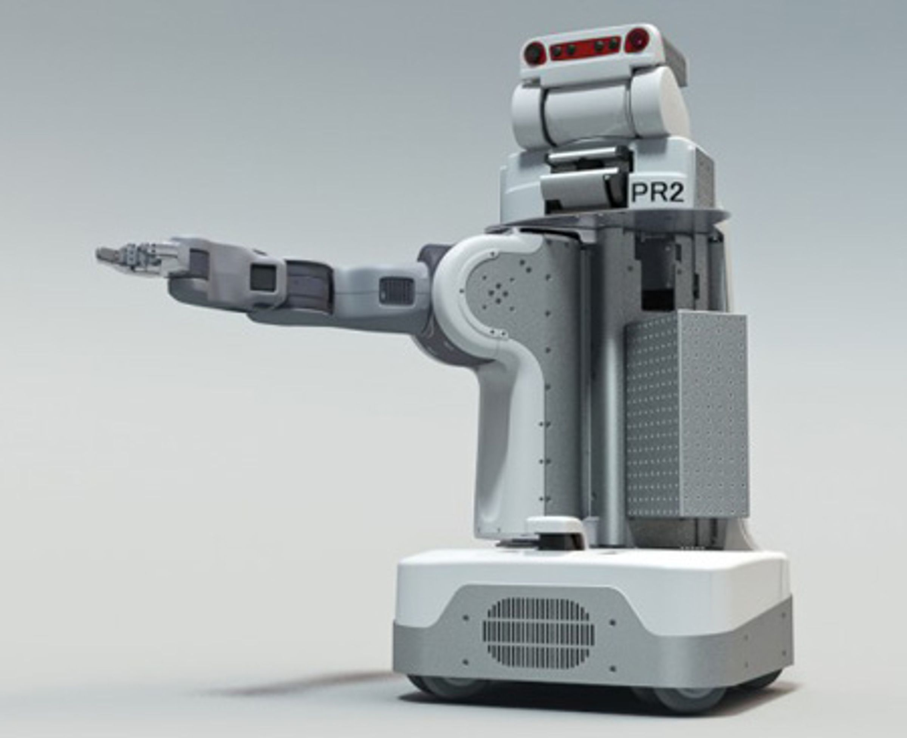
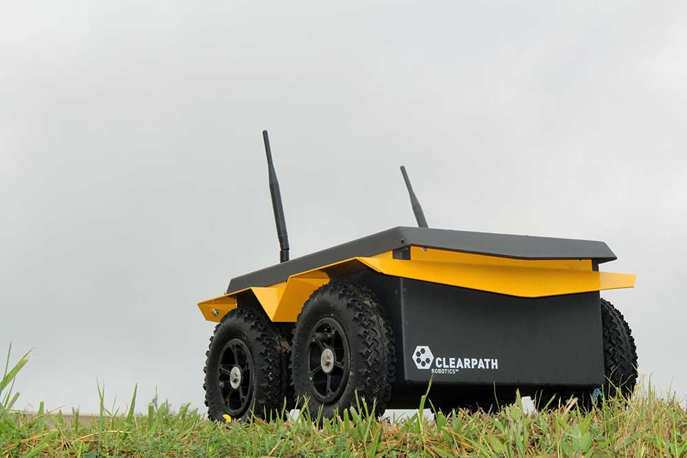
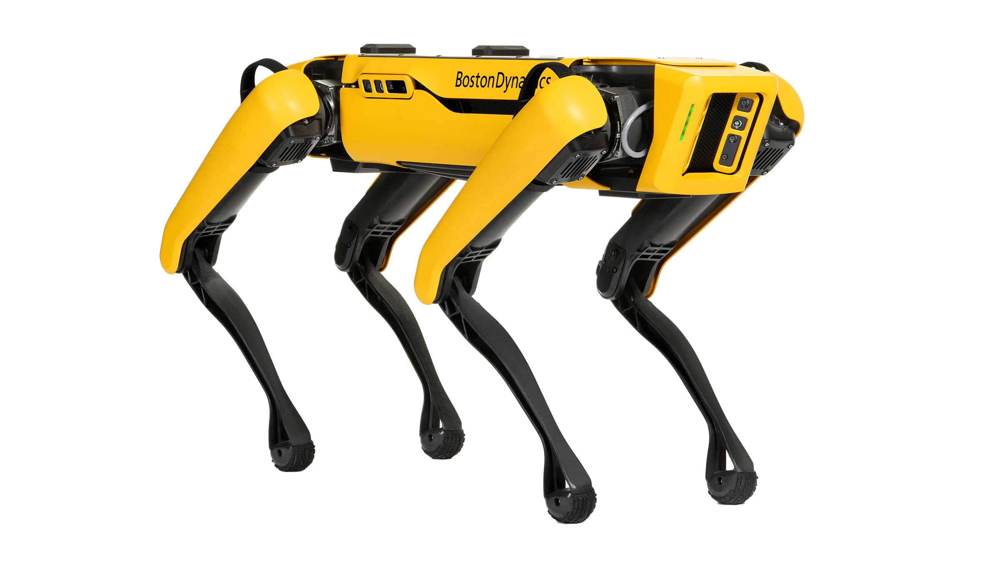

# Task and Motion Planning Library (TAMPL)

## Build instructions for development (temporary)

### setup
```
$ git clone --recursive https://github.com/mlsdpk/tampl.git
$ python -m venv tampl_venv
$ source tampl_venv/bin/activate
$ pip install -r requirements.txt
```

### build and install pytampl
```
$ pip install . --config-settings=build.tool-args=-j8
```

### build and install pytampl-extensions
```
$ cd extensions && pip install .
```

## Use Cases / Examples

### Task Planning in PDDLGym

You can use TAMPL’s Python bindings to perform task planning directly within [PDDLGym](https://github.com/tomsilver/pddlgym/) environments. The provided example script demonstrates how to solve tasks in a PDDLGym environment and generate a visual solution as a GIF. Simply modify the script to adjust the environment settings as needed. 

To run the example:

```bash
$ python examples/pddlgym_task_planning.py
```


<p align="left">
  
  
  
</p>

### Motion Planning in PyBullet

TAMPL’s Python bindings provide an out-of-the-box experience for motion planning in PyBullet-based environments. The underlying motion planners are integrated with OMPL, allowing you to leverage all of OMPL's powerful C++ features while executing high-level behaviors in Python through PyBullet.

#### Supported Robotic Platforms

**Manipulators**

| Brand  | Model             |                                                     |                                                         |
|--------|-------------------|-----------------------------------------------------|---------------------------------------------------------|
| Franka | Franka Research 3 |  |  |

**Mobile Platforms**
| Brand              | Model  |                                                        |                |
|--------------------|--------|--------------------------------------------------------|----------------|
| Willow Garage      | PR2    |     | Coming soon... |
| Clearpath Robotics | Jackal |  | Coming soon... |

**Legged Robots**
| Brand           | Model |                                                      |                |
|-----------------|-------|------------------------------------------------------|----------------|
| Boston Dynamics | Spot  |  | Coming soon... |

## Issues
- [x] Example python script cannot find dylib at runtime. Manually setting is still required at the moment as: `export DYLD_LIBRARY_PATH=<path-to-dylib>:$DYLD_LIBRARY_PATH`
- [ ] Fix FF planner build failure on Unix
- [ ] yaml-cpp not found on mac and requires setting this before compiling at the moment as: `export LIBRARY_PATH=$(brew --prefix yaml-cpp)/lib:$LIBRARY_PATH`
- [ ] pybullet rendering not using material properties from .dae files yet (consider using .obj, .mtl files with pybullet.URDF_USE_MATERIAL_COLORS_FROM_MTL flag upon loadURDF call)
