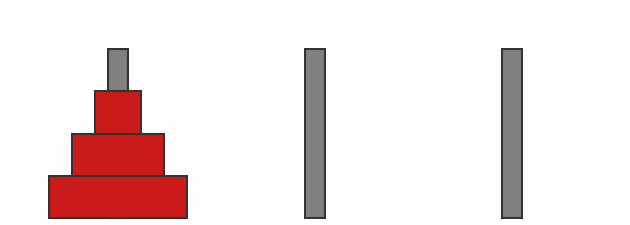

# Task and Motion Planning Library (TAMPL)

## Development Guide

### Prerequisites

**Docker**: Ensure you have Docker installed on your machine. You can download and install Docker from [here](https://docs.docker.com/engine/install/).

### First-Time Setup

1. **Clone the Repository**
   Clone the repository to your local machine:
   ```bash
   $ git clone https://github.com/mlsdpk/tampl.git
   $ cd tampl
   ```

2. **Set Up the Development Environment**
   Run the following command **from the repository's top-level directory** to build and launch the development environment:
   ```bash
   $ docker compose up --build dev
   ```
   > **Note:** This process will install all necessary dependencies and may take some time, depending on your machine's performance.

   If successful, you should see output similar to:
   ```plaintext
   => => naming to docker.io/library/tampl:dev
   [+] Running 1/1
    ✔ Container tampl-dev-1  Recreated
   Attaching to tampl-dev-1
   ```

### GUI Support

If your development workflow requires a graphical user interface (GUI), follow these steps to enable GUI access via **NoVNC**:

1. **Launch the NoVNC Service**
   Open a new terminal, navigate to the repository's top-level directory, and execute:
   ```bash
   $ docker compose up --build novnc
   ```
   This will start a NoVNC server that provides a browser-based VNC (Virtual Network Computing) interface for interacting with your development container’s GUI.

2. **Access the GUI**
   Open a web browser and go to:
   [http://localhost:8080/vnc.html](http://localhost:8080/vnc.html)

   You should now see the graphical interface of your Docker container.

### Development Workflow

1. **Access the Development Container**
   Ensure the development container is running (see the [First-Time Setup](#first-time-setup) section). Open a new terminal and run:
   ```bash
   $ docker exec -it tampl-dev-1 bash
   ```

   This command will give you an interactive shell inside the container.

2. **Build and Install `pytampl`**
   To build and install the core `pytampl` module, run:
   ```bash
   $ pip install . --config-settings=build.tool-args=-j8
   ```

3. **Build and Install `pytampl-extensions`**
   To build and install the `pytampl-extensions` module, navigate to the `extensions` directory:
   ```bash
   $ cd extensions
   $ pip install .
   ```

## Use Cases / Examples

### Task Planning in PDDLGym

You can use TAMPL’s Python bindings to perform task planning directly within [PDDLGym](https://github.com/tomsilver/pddlgym/) environments. The provided example script demonstrates how to solve tasks in a PDDLGym environment and generate a visual solution as a GIF. Simply modify the script to adjust the environment settings as needed. 

To run the example:

```bash
$ python examples/pddlgym_task_planning.py
```


<p align="left">
  
  
  
</p>

### Motion Planning in PyBullet

TAMPL’s Python bindings provide an out-of-the-box experience for motion planning in PyBullet-based environments. The underlying motion planners are integrated with OMPL, allowing you to leverage all of OMPL's powerful C++ features while executing high-level behaviors in Python through PyBullet.

#### Supported Robotic Platforms

**Manipulators**

| Brand  | Model             |                                                     |                                                         |
|--------|-------------------|-----------------------------------------------------|---------------------------------------------------------|
| Franka | Franka Research 3 |  |  |

**Mobile Platforms**
| Brand              | Model  |                                                        |                |
|--------------------|--------|--------------------------------------------------------|----------------|
| Willow Garage      | PR2    |     | Coming soon... |
| Clearpath Robotics | Jackal |  | Coming soon... |

**Legged Robots**
| Brand           | Model |                                                      |                |
|-----------------|-------|------------------------------------------------------|----------------|
| Boston Dynamics | Spot  |  | Coming soon... |

## Issues
- [x] Example python script cannot find dylib at runtime. Manually setting is still required at the moment as: `export DYLD_LIBRARY_PATH=<path-to-dylib>:$DYLD_LIBRARY_PATH`
- [ ] Fix FF planner build failure on Unix
- [ ] yaml-cpp not found on mac and requires setting this before compiling at the moment as: `export LIBRARY_PATH=$(brew --prefix yaml-cpp)/lib:$LIBRARY_PATH`
- [ ] pybullet rendering not using material properties from .dae files yet (consider using .obj, .mtl files with pybullet.URDF_USE_MATERIAL_COLORS_FROM_MTL flag upon loadURDF call)
